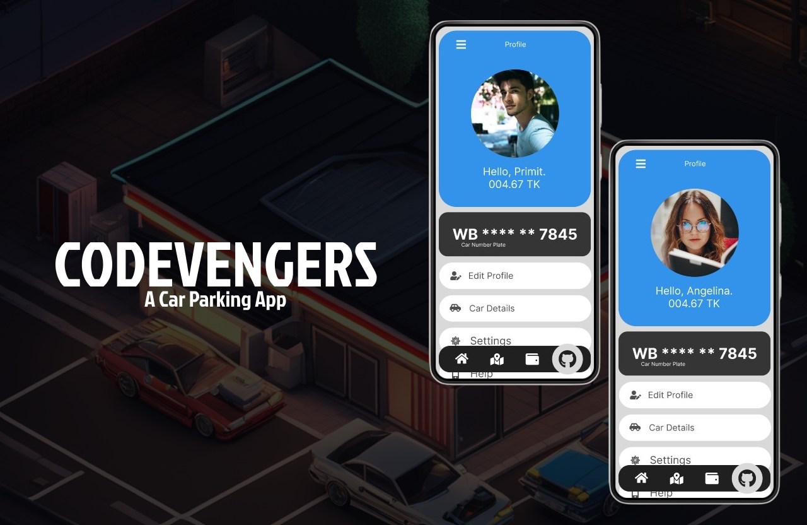

# CodeVengers - An innovation to solve the parking problem in India©  

 <kbd></kbd>

 

## Table of Contents

- [About the Project](#about-the-project)
- [Inspiration](#inspiration)
- [Use Cases](#use-cases)
- [Real World Problem the Project Solves](#real-world-problem-the-project-solves)
- [Overview](#overview)
- [Challenges faced while developing the project](#challenges-faced-while-developing-the-project)
- [What's Next - Future plans for the project](#whats-next---future-plans-for-the-project)
- [Tech Stack](#tech-stack)
- [Contribution](#contribution)
- [License](#license)
- [Conclusion](#conclusion)

## About the Project

CodeVengers is a Hackathon Project targeted towards creating an innovation toward automation.

CodeVengers is a software which is designed to be used in Parking Lot to check which cars enter the parking and how long they will stay and according to that money will be charged.

## Inspiration

Though this app has nothing to do with car renting, our inspiration came from **Ola** and **Uber** which provides cab service. Our idea of creating a Parking system which uses one admin for management while rest of the task is automated.

## Use Cases

Imagine you are going to Victoria Memorial with a car, and you are facing a parking issue. Finding a proper parking location is hard and then remembering where you have parked is a big hassle. This is where our app will come to play to help you find the nearest parking spot and make reservations. It removes the headache which comes with car parking in city sides.

## Real World Problem the Project Solves

The parking problem in India is a complex and widespread issue that affects urban areas across the country. Rapid urbanization, population growth, and increased vehicle ownership have exacerbated the challenges associated with parking. Here's an overview of the parking problem in India:

1. **Limited Infrastructure**: Many Indian cities lack adequate parking infrastructure to accommodate the increasing number of vehicles. Older cities with narrow streets and unplanned layouts struggle to provide insufficient parking spaces.

2. **Population Density**: India is one of the most densely populated countries in the world. High population density in urban areas leads to intense competition for limited parking spaces, both on the streets and in commercial areas.

3. **Rising Vehicle Ownership**: The rising middle class and improved economic conditions have led to a surge in vehicle ownership. The rapid growth in the number of vehicles far outpaces the development of parking facilities.

4. **Illegal Parking**: Due to the scarcity of legal parking spaces, many vehicle owners resort to illegal parking on sidewalks, in no-parking zones, and other unauthorized areas. It also reduces the road space, thus creating problems in smooth movement of vehicles. This exacerbates traffic congestion and pedestrian safety issues.

5. **Traffic Congestion**: Improperly parked vehicles contribute to traffic congestion, as they block roads and impede the smooth flow of traffic. This has a domino effect, leading to longer commute times.

6. **Commercial Areas**: Business districts and commercial areas face acute parking shortages. Lack of designated parking for shoppers and employees often results in vehicles occupying spaces meant for other purposes.

7. **Residential Complexes**: Even residential complexes often struggle to provide adequate parking for their residents. This has led to conflicts among residents and disputes over limited parking spaces.

8. **Public Transportation**: While some Indian cities have developed public transportation systems like buses and metro networks, they are often underutilized due to the convenience and perceived status associated with private vehicle ownership.

9. **Parking Pricing**: In some areas, parking pricing is not reflective of market demand. Cheap or free parking in premium locations encourages more people to drive, exacerbating the parking shortage.

10. **Lack of Enforcement**: Inefficient enforcement of parking regulations and lack of penalties for illegal parking contribute to the persistence of the problem. The monopoly of middlemen and corruption leads to big problem for the common people. Their demand of unfair prices and their unfair practices is a big problem for the society.

11. **Environmental Impact**: The increased number of vehicles, coupled with inefficient parking management, contributes to air and noise pollution and worsens the urban environment.

To address the parking problem in India, a multi-faceted approach is necessary. This could include city planning that prioritizes parking infrastructure, implementing stricter parking regulations and enforcement, promoting the use of public transportation, adopting technology-based parking solutions, encouraging carpooling and shared mobility options, and raising awareness about responsible parking behavior among citizens.

## Overview

- At first the user has to create an accout in the app.
- After creating account, user can book a car parking slot by entering their location details like pincode or address.
- After that user can book a car parking slot by entering their details.
- The admin has to enter all the slots which are available at any given time, so that the users can avail those slots.
- The admin has to approve or reject the booking request from users.
- Once approved, the slots are available for use.
- If there's no space left then the system automatically sends notification to the owner of the slot.
- Users can check their status whether they've been accepted or rejected by the admins.
- Admins can see all requests and their statuses.
- All data is stored on MongoDB realtime database.
- For sending notifications we shall use Google Cloud Messaging service(incomplete).

## Chalenges faced while developing the project

- **Android Studio:** Working with Android Studio was quite a hassle as it requires high computer specifications and good infrastructure.
- **MongoDB Compass:** It was hard to connect the MongoDB shell and hard to run Shell commands and edit directly.
- **Expo Project:** Random pathfinding error which gets easily fixed after restart.
- **Massive Backend:** Consisting of multiple Data Bases, Machine Learning models, Google's Map API and a custom API for parking.

## What's Next - Future plans for the project

At first our main target is to complete the app and test it in real life application. Then pitch the idea to a potential Investor (mainly:The Government of India).

## Tech Stack

1. **React Native:**
   React Native is a popular open-source framework for building mobile applications using JavaScript and React. It allows developers to create native mobile apps for both iOS and Android platforms using a single codebase. By leveraging a component-based architecture, React Native enables the development of rich, responsive, and visually appealing mobile apps that closely resemble native applications.

2. **ExpressJS:**
   Express.js is a minimal and flexible web application framework for Node.js. It simplifies the process of building robust and scalable web applications and APIs by providing a range of essential features and tools. Express.js offers a straightforward way to handle routing, middleware, request handling, and response management, making it a preferred choice for developers when building server-side components of web applications.

3. **MongoDB:**
   MongoDB is a widely used NoSQL database system known for its flexibility and scalability. It stores data in a document-oriented format using JSON-like documents, which allows for dynamic and schema-less data storage. MongoDB is suitable for applications requiring agile development, as it accommodates changes in data structure easily and can handle large amounts of data while providing high performance.

4. **Node.js:**
   Node.js is a JavaScript runtime built on the V8 JavaScript engine. It enables developers to execute JavaScript code on the server side, rather than just in web browsers. Node.js excels in building scalable and high-performance applications due to its asynchronous, event-driven architecture. It's often used to build backend services, APIs, and real-time applications.

These technologies, when used together, form a powerful stack for developing modern web and mobile applications. React Native allows you to create a unified mobile app experience, while ExpressJS and Node.js provide the backend infrastructure for handling requests and data processing. MongoDB offers a flexible and scalable database solution that complements the needs of dynamic and growing applications. This stack is known for its efficiency, ease of use, and ability to handle both frontend and backend development using JavaScript, streamlining the development process.

## Contribution

**Concept:** [Promit Chaudhuri](https://github.com/ProSkywalker16) and [Subhadip Santra](https://github.com/Subhadip05Santra)  
**Design:** [Promit Chaudhuri](https://github.com/ProSkywalker16) and [Debarshee Chakraborty](https://github.com/debarshee2004)  
**Frontend:** [Debarshee Chakraborty](https://github.com/debarshee2004) and [Subhadip Santra](https://github.com/Subhadip05Santra)  
**Backend:** [Promit Chaudhuri](https://github.com/ProSkywalker16) and [Soham Bannerjee](https://github.com/sohambanerjee10)  
**API:** [Subhadip Santra](https://github.com/Subhadip05Santra) and [Soham Bannerjee](https://github.com/sohambanerjee10)  
**Documentation:** [Debarshee Chakraborty](https://github.com/debarshee2004)

**LinkedIn**  
[Promit Chaudhuri](https://www.linkedin.com/in/promit-chaudhuri-2979b8274/) 
[Subhadip Santra](https://www.linkedin.com/in/subhadip-santra-82b250267/) 
[Debarshee Chakraborty](https://www.linkedin.com/in/debarshee-chakraborty-a88b47266/) 
[Soham Bannerjee](https://www.linkedin.com/in/soham-banerjee-8476ab28a/)

## License

The Codevengers application is distributed under the [MIT License](LICENSE), which means you're free to use, modify, and distribute the code as per the terms of the license.

For detailed usage instructions and guides, please refer to the [User Guide](https://github.com/debarshee2004/InterHacktive_CodeVengers/blob/main/Documents/UserGuide.md) and [Admin Guide](https://github.com/debarshee2004/InterHacktive_CodeVengers/blob/main/Documents/AdminGuide.md) provided in the repository.

## Conclusion

Feel free to explore the CodeVengers repository and contribute to making urban parking a hassle-free experience for everyone. If you have any questions, concerns, or feedback, please don't hesitate to get in touch with us via the Issues section or by contacting the project maintainers. Happy parking! 🚗💨
